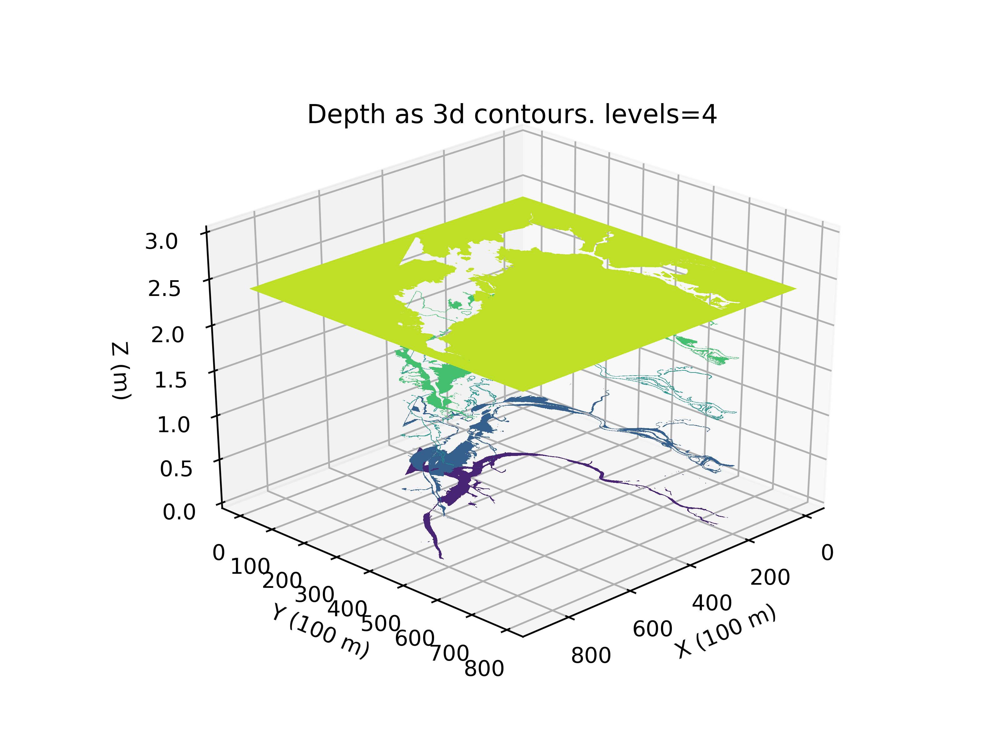
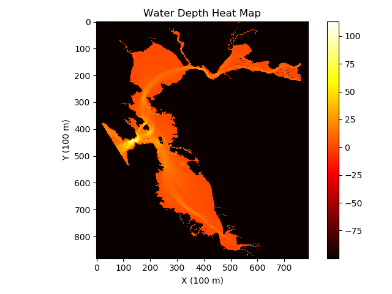
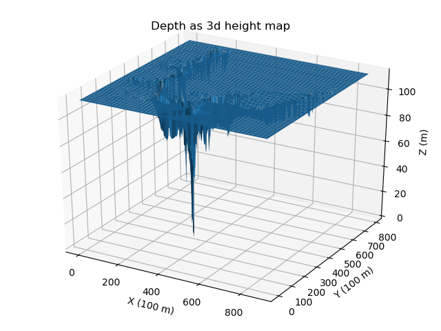

# coffee-table

Tools, visuals and CAD related to the design of a custom coffee table derived from bathymetry data.





## Setup

A conda [environment.yml](environment.yml) has been provided.

```bash
# Build environment
conda env create -f environment.yml

# Launch environment
source activate coffee-table
```

Alternatively, a [requirements.txt](requirements.txt) file has been provided.

```bash
pip install -r requirements.txt
```
