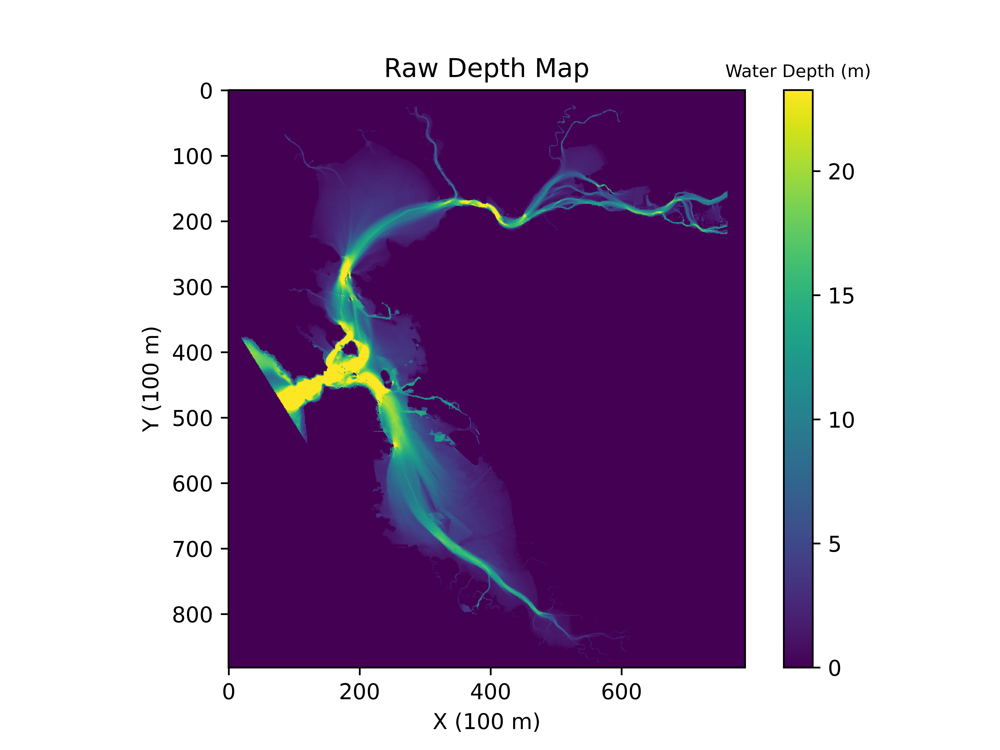
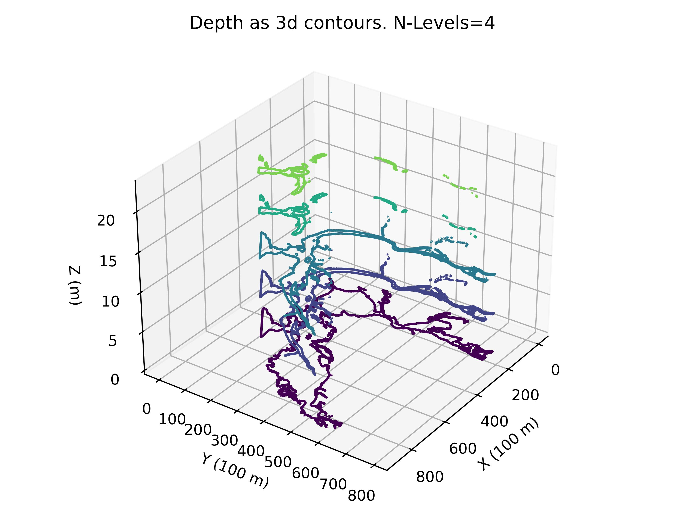
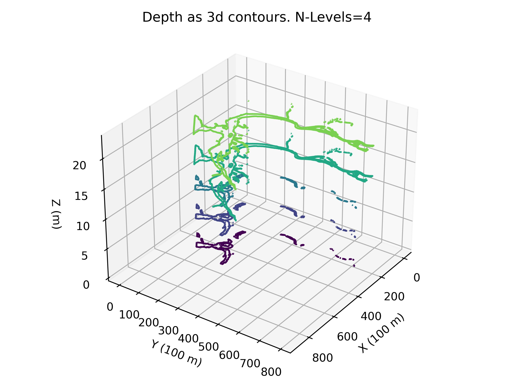
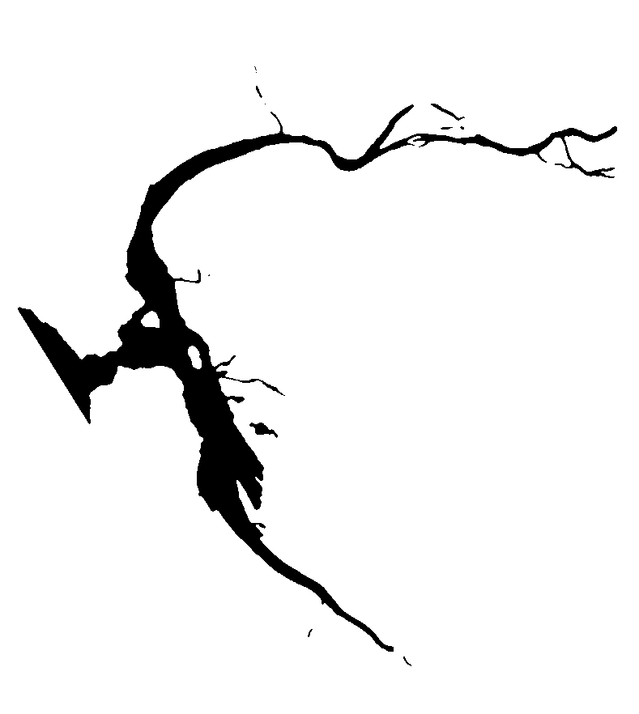
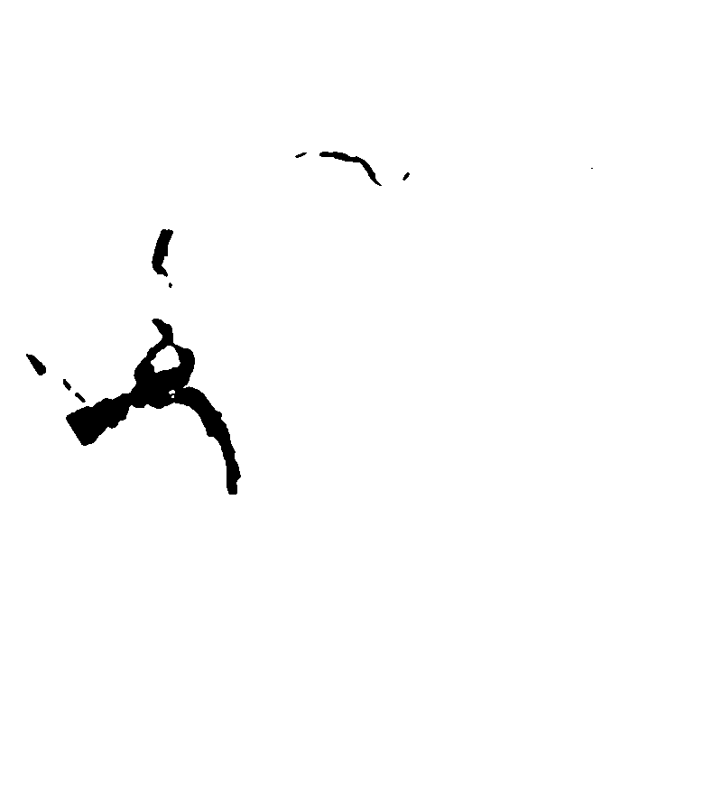

# coffee-table

Tools, visuals and CAD related to the design of a custom coffee table derived from bathymetry data.

## Cad Renders

Cad Render             |  Cad Render
:-------------------------:|:-------------------------:
  | 
  | 
  |  
  |  
 | 

## Contour Quantization

The distribution of depth values is not uniform. That is to say, there are outliers, where depth changes dramatically in a very small region.


In order to create more meaningful contours, the depth data is clipped (outliers removed) and quantized to better smooth the raw data for the purposes of this project.

Raw             |  Quantized
:-------------------------:|:-------------------------:
  |  
  |  

Regular             |  Inverted
:-------------------------:|:-------------------------:
  |  

Isolated Masks for each quantized layer:

 a | Layer 0 | Layer 1 | Layer 2
:-------------------------:|:-------------------------:|:-------------------------:|:-------------------------:
quantized layer before smoothing |  |  | 
quantized layer after smoothing |  |  | 

## Raw Depth Visualization

Regular             |  Inverted
:-------------------------:|:-------------------------:
  |  
  |  
  |  
  |  

## Setup

A conda [environment.yml](environment.yml) has been provided.

```bash
# Build environment
conda env create -f environment.yml

# Launch environment
source activate coffee-table
```

Alternatively, a [requirements.txt](requirements.txt) file has been provided.

```bash
pip install -r requirements.txt
```
